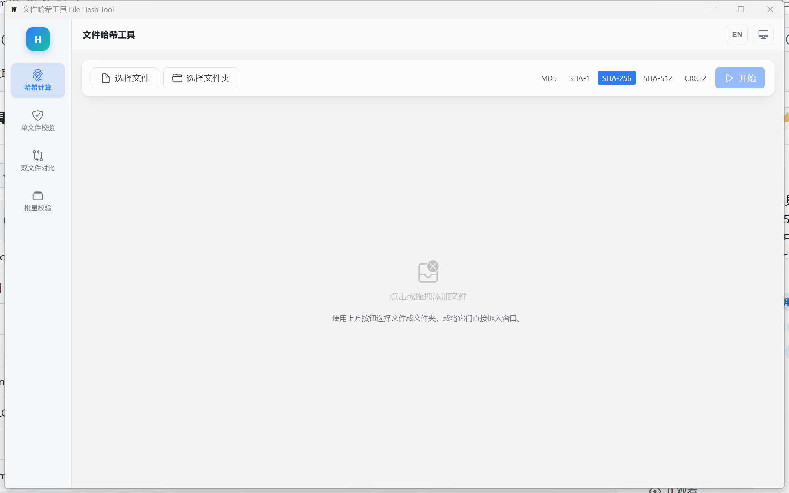

<div align="center">


# GoHashTool

**文件哈希工具 —— 计算 · 校验 · 对比 · 批量清单验证**

[](https://github.com/WanQTs/GoHashTool/releases)
[](https://github.com/WanQTs/GoHashTool/actions/workflows/ci.yml)
[](https://go.dev/)
[](https://v3.wails.io/)
[](https://vuejs.org/)
[](https://github.com/WanQTs/GoHashTool)
[](LICENSE)

**中文** · [English](README_EN.md)

[✨ 功能特性](#-功能特性) · [📸 界面截图](#-界面截图) · [📥 下载](#-下载) · [🚀 使用方法](#-使用方法) · [⚡ 性能实测](#-性能实测) · [🛠️ 从零构建](#-从零构建)

</div>

---

Windows 64 位桌面工具，用于文件哈希值的获取与对比。技术栈为 **Wails v3 + Go + Vue 3 + TypeScript**，纯本地运行、无网络请求、无遥测，最终交付为**单文件 exe**。

## ✨ 功能特性

- **哈希计算**：多选文件、文件夹递归、整窗拖拽添加；MD5 / SHA-1 / SHA-256 / SHA-512 / CRC32 多算法一次扫描；结果表格虚拟滚动（十万级行数不卡）；点击哈希值复制；不可读子目录生成「无权限」结果行，绝不静默漏算。
- **单文件校验**：粘贴期望哈希，按长度自动识别算法（8=CRC32、32=MD5、40=SHA-1、64=SHA-256、128=SHA-512），大字号给出「一致 / 不一致」结论。
- **双文件对比**：选两个文件同算法对比，并排展示各算法哈希值。
- **批量校验**：导入 md5sum/sha256sum 标准清单（.sha256/.sha1/.sha512/.md5/.txt/.sum/.sums，支持 `#` 注释行），扩展名×哈希长度交叉校验识别算法；基准目录可切换；输出 通过/不一致/缺失/无法读取 四类统计与明细；一键导出问题项。
- **导出**：CSV（带 UTF-8 BOM，Excel 直开不乱码）与标准 SUM 格式；导出的 SUM 可被批量校验重新导入（闭环，有集成测试保障）。CRC32 因无法重新导入而不提供 SUM 导出。
- **界面**：Mica 云母窗口材质（Win11，低版本系统自动回退）、浅色/深色主题（默认跟随系统）、中英双语即时切换（默认跟随系统语言）、150–250ms 过渡动画、空状态引导。

## 📸 界面截图

<div align="center">



</div>

## 📥 下载

前往 [**Releases**](https://github.com/WanQTs/GoHashTool/releases) 下载 `GoHashTool-*.exe`——单文件绿色软件，双击即用，无需安装（另附 UPX 压缩版，体积更小）。

要求 64 位 Windows 10/11 与 WebView2 运行时（Windows 11 已预装）。

## 🚀 使用方法

1. **哈希计算**：点击「选择文件 / 选择文件夹」，或直接把文件/文件夹拖进窗口；勾选算法（默认 SHA-256）后点「开始」。计算中显示总进度条、当前文件、已用时间、实时速度，可随时取消。
2. **单文件校验**：选择文件并粘贴期望哈希值，自动识别算法，完成后显示对比结论。
3. **双文件对比**：分别选择两个文件，点击「开始对比」。
4. **批量校验**：选择清单文件（或直接把清单文件拖进窗口，会自动跳转并开始校验）；默认以清单所在目录为基准解析相对路径，也可手动指定其他基准目录。
5. **导出**：结果出来后点击「导出 CSV」或「导出 SUM」；批量校验页可单独导出问题项。

## ⚡ 性能实测

测试硬件：

- CPU: AMD Ryzen 9 9950X 16-Core · 磁盘: TOPMORE Dubhe NVMe SSD · 内存: 96 GB
- 系统: Windows 11 专业工作站版 · Go 1.26.6（标准库 SHA-256/SHA-512 走 SHA-NI/AVX2 汇编路径）

`go test -run='^$' -bench=. -benchtime=1x ./internal/hashcore/` 实测输出：

```
goos: windows
goarch: amd64
pkg: gohash/internal/hashcore
cpu: AMD Ryzen 9 9950X 16-Core Processor
BenchmarkSHA256LargeFile-32       1   416024500 ns/op    1074 MB_total
BenchmarkSHA256MD5LargeFile-32    1  1324298300 ns/op    1074 MB_total
BenchmarkManySmallFiles-32        1    84642400 ns/op    10.24 MB_total
```

| 基准项 | 目标 | 实测 | 达标 |
| --- | --- | --- | --- |
| SHA-256 单文件 1GB | ≤ 3 s | **0.42 s**（约 2.5 GB/s） | ✅ |
| SHA-256 + MD5 双算法同扫 1GB | ≤ 3.5 s | **1.32 s** | ✅ |
| 1 万个 1KB 小文件批量 | ≤ 10 s | **0.08 s** | ✅ |
| 冷启动到可交互 | < 2 s | **约 0.45 s**（冒烟脚本实测窗口出现耗时） | ✅ |
| 内存占用 | RSS 增量 < 100 MB | 流式 + 池化缓冲，任意大小文件内存恒定；启动后 RSS ≈ 33 MB | ✅ |

> 基准夹具在同一进程内跨 benchmark 复用，首轮后可能命中 OS 页缓存——上表为**热缓存吞吐**，非冷盘首读成绩。

设计取舍（详见源码注释）：流式读取 + 自适应缓冲（<64MB 用 1MB、大文件 16MB，`sync.Pool` 复用）；大文件双缓冲流水线（预读与哈希计算重叠）；多算法 `io.MultiWriter` 一次扫描；小文件 worker pool 并发 `min(NumCPU, 8)`；进度上报 200ms 节流、表格数据分批 ≤500 条推送。

## 🛠️ 从零构建

前置条件：

- Go 1.25+、Node.js 20.19+（Vite 7 要求）
- Wails CLI v3：`go install github.com/wailsapp/wails/v3/cmd/wails3@v3.0.0-beta.9`
- 可选：MSYS2 MinGW-w64 GCC（仅 `go test -race` 需要；构建 exe 时 CGO 关闭，不需要 GCC）
- `wails3 doctor` 全部通过

```bash
# 1. 安装前端依赖
cd frontend && npm install && cd ..

# 2. 构建单文件 exe（production：无控制台窗口；图标/清单/版本信息经 syso 嵌入）
wails3 build
# 产物: bin/gohash.exe

# 3. 可选：UPX 压缩体积
upx --best bin/gohash.exe
```

开发模式：

```bash
wails3 dev                    # 热重载开发
go test ./...                 # 单元 + 集成测试
go test -race ./...           # 竞态检测（需 GCC）
go vet ./... && gofmt -l .    # 静态检查与格式
cd frontend && npm run test   # 前端纯函数单测（vitest）
cd frontend && npm run build  # 前端类型检查与构建
wails3 generate bindings -ts  # 后端方法变更后重新生成前端绑定
```

冒烟脚本：

```powershell
powershell -ExecutionPolicy Bypass -File tools/smoke-test.ps1
# 先跑 bin/gohash.exe --selftest 无界面自检（验退出码），再测启动耗时与 RSS、截图
```

## 🗂️ 项目结构

```
main.go                  Wails v3 入口（窗口选项、Mica 背景、文件拖拽事件转发、--selftest 分支）
app.go                   后端服务方法、任务管理、进度事件（200ms 节流）
selftest.go              --selftest 无界面自检：已知值 / SUM 闭环 / 清单解析，退出码报告
Taskfile.yml             构建编排入口（wails3 build = go-task 封装）
build/config.yml         项目元数据与 dev 模式配置
build/windows/           Windows 构建资产（icon.ico、info.json、wails.exe.manifest、Taskfile）
internal/hashcore/       哈希核心：流式引擎、双缓冲流水线、worker pool（纯 Go，可独立测试）
internal/checksum/       清单解析、算法识别、对比、CSV/SUM 导出（纯 Go）
frontend/bindings/       wails3 generate bindings 生成的 TS 绑定（不要手改）
frontend/src/            Vue 3 + TypeScript + Naive UI + vue-i18n
  views/                 四个功能页（hash / verify / compare / batch）
  components/            algo-chips / result-table（虚拟滚动）/ progress-panel
  stores/                pinia 设置（主题、语言，localStorage 持久化）
  locales/               zh-cn.json / en-us.json
  api/                   绑定封装与事件会话（前端与后端交互的唯一入口）
tools/smoke-test.ps1     冒烟测试脚本（selftest 退出码 / 启动耗时 / RSS / 截图）
```

## 🛡️ 可靠性设计

- 后端错误全部结构化返回（错误码 + 中英双语信息），前端统一 toast；无 panic、无静默吞错；任务 goroutine 有 recover 兜底，panic 时前端收到带 `fatal` 的完成事件而非卡死。
- 文件被占用 / 无权限 / 已删除单独标记状态，不中断整批任务；不可读子目录生成可见错误行。
- `context.Context` 贯穿所有任务，取消 1 秒内生效；取消句柄随任务注册同步登记。
- 已完成任务结果仅保留最近 4 个供导出复用；导出先写临时文件再 rename（原子替换）。
- exe 清单声明 `longPathAware`（系统启用长路径策略后可处理超 260 字符路径）。
- 哈希比较忽略大小写；清单解析兼容 `*文件名` 二进制标记、行首 `\` 转义、空格文件名、UTF-8 BOM、CRLF/LF 混用、`#` 注释行；重复条目按路径去重（首条胜出）。
- 测试：Go 单测/竞态检测 + SUM 闭环集成测试 + 前端 vitest + exe 级 `--selftest` 与冒烟脚本。

---

<div align="center">

**如果这个小工具帮到了你，欢迎点个 ⭐ Star**

[发布下载](https://github.com/WanQTs/GoHashTool/releases) · [MIT 许可证](LICENSE) © 2026 WanQTs · 历史版本：[v2 分支](https://github.com/WanQTs/GoHashTool/tree/v2)（Wails v2 存档）

</div>
